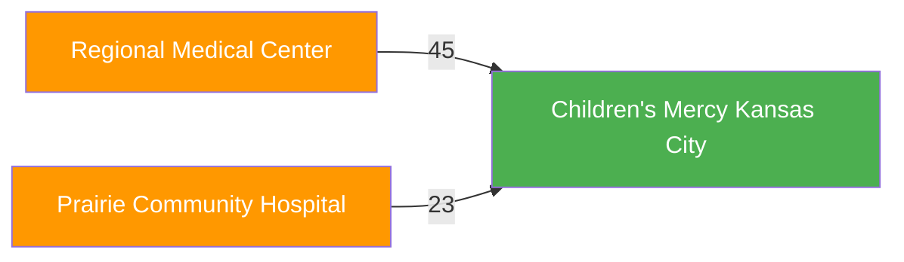

# Referral Network Analytics Agent

A CLI-based AI agent for querying healthcare referral network data. Supports multiple LLM backends: **Azure OpenAI** and **DigitalOcean Gradient**.

## Architecture

This agent uses a **decoupled architecture** that separates the LLM reasoning layer from the data layer. The LLM platform only decides *what* tools to call - the actual database queries run in your agent code.

```
┌─────────────────────────────────────────────────────────────┐
│                LLM Platform (Interchangeable)               │
│       Azure OpenAI  │  Gradient  │  OpenAI  │  Ollama       │
│                                                             │
│   • Receives user question + tool definitions               │
│   • Decides which tools to call                             │
│   • Generates natural language responses                    │
│   • Has NO direct database access                           │
└─────────────────────────────────────────────────────────────┘
                              ▲
                              │ API calls only
                              ▼
┌─────────────────────────────────────────────────────────────┐
│                Agent Code (runs anywhere)                   │
│                                                             │
│   • Orchestrates conversation flow                          │
│   • Executes tools locally when LLM requests them           │
│   • Manages database connections                            │
│                                                             │
│   Deployment options:                                       │
│   • Local machine (python run_agent.py)                     │
│   • Gradient serverless (gradient agent deploy)             │
│   • Azure Functions / AWS Lambda                            │
│   • Kubernetes / Docker container                           │
└─────────────────────────────────────────────────────────────┘
                              │
                              │ Gremlin queries
                              ▼
┌─────────────────────────────────────────────────────────────┐
│                     Azure Cosmos DB                         │
│                   (Graph Database)                          │
└─────────────────────────────────────────────────────────────┘
```

### How Tool Calling Works

1. **User asks a question** → Agent sends it to the LLM with tool definitions
2. **LLM decides** → "I need to call `get_referral_sources` with these arguments"
3. **Agent executes locally** → Runs the Python function that queries Cosmos DB
4. **Results sent to LLM** → LLM generates a natural language response

```python
# The LLM only sees tool DEFINITIONS (not implementations)
tools = [{
    "name": "get_referral_sources",
    "description": "Find hospitals that refer to a hospital",
    "parameters": {...}
}]

# YOUR CODE executes the actual database query
result = agent_tools.get_referral_sources("Children's Mercy Kansas City")
```

### Benefits of This Architecture

| Benefit | Description |
|---------|-------------|
| **LLM Portability** | Switch between Azure OpenAI, Gradient, or any provider without changing database code |
| **Security** | Database credentials never sent to LLM platform |
| **Flexibility** | Deploy agent code anywhere - local, serverless, containers |
| **Testability** | Test tools independently of LLM |

### Layer Responsibilities

| Layer | File(s) | Responsibility |
|-------|---------|----------------|
| **LLM Platform** | External service | Reasoning, tool selection, response generation |
| **Agent Orchestration** | `run_agent.py`, `main.py` | Conversation flow, tool execution |
| **Tool Implementations** | `agent_tools.py` | Database queries, business logic |
| **Database Connection** | `cosmos_connection.py` | Gremlin client, connection management |

## Setup

### Prerequisites

- Python 3.10+
- Azure Cosmos DB account (for the graph database)
- Either Azure OpenAI or DigitalOcean Gradient account

### Install Dependencies

```bash
pip install -r requirements.txt
```

For Gradient deployment, also install:
```bash
pip install gradient-adk gradient
```

### Configure Environment

Create a `.env` file with your configuration:

```bash
# Cosmos DB Configuration
COSMOS_ACCOUNT_NAME=your-cosmos-account
COSMOS_PRIMARY_KEY=your-primary-key
COSMOS_DATABASE=referral-network
COSMOS_GRAPH=hospital-graph

# Agent Provider: "azure" or "gradient"
AGENT_PROVIDER=azure

# Azure OpenAI Configuration
AZURE_OPENAI_ENDPOINT=https://your-resource.openai.azure.com/
AZURE_OPENAI_API_KEY=your-azure-openai-key
AZURE_OPENAI_DEPLOYMENT=gpt-4o-mini
AZURE_OPENAI_API_VERSION=2024-06-01

# Gradient (DigitalOcean) Configuration
DIGITALOCEAN_API_TOKEN=your-digitalocean-api-token
GRADIENT_MODEL_ACCESS_KEY=your-gradient-model-access-key
GRADIENT_MODEL=openai-gpt-oss-120b
```

## Usage

### Quick Start

Run the unified launcher:

```bash
python run_agent.py
```

### Switching Providers

**Option 1: Environment Variable**

Set `AGENT_PROVIDER` in your `.env` file:
```bash
AGENT_PROVIDER=azure     # Use Azure OpenAI
AGENT_PROVIDER=gradient  # Use DigitalOcean Gradient
```

**Option 2: Command Line Flags**

```bash
python run_agent.py --azure     # Force Azure OpenAI
python run_agent.py --gradient  # Force Gradient
python run_agent.py --test      # Test database connection only
```

### Example Queries

```
You: Give me an overview of the referral network
You: Which hospitals refer patients to Children's Mercy?
You: Find providers who specialize in cardiology
You: What's the referral path from Prairie Community Hospital to Children's Mercy Kansas City?
```

Type `quit` or `exit` to close the agent.

## Provider Configuration

### Azure OpenAI

1. Create an Azure OpenAI resource in the Azure portal
2. Deploy a model (e.g., `gpt-4o-mini`)
3. Copy the endpoint and API key to your `.env`:
   ```bash
   AZURE_OPENAI_ENDPOINT=https://your-resource.openai.azure.com/
   AZURE_OPENAI_API_KEY=your-key
   AZURE_OPENAI_DEPLOYMENT=gpt-4o-mini
   ```

**Note:** The S0 tier has low token rate limits. If you encounter 429 errors, wait 60 seconds or upgrade your tier.

### DigitalOcean Gradient

1. Sign up for DigitalOcean and enable AI/ML features
2. Create a Gradient model access key from the AI console
3. Copy your credentials to `.env`:
   ```bash
   GRADIENT_MODEL_ACCESS_KEY=sk-do-your-key
   GRADIENT_MODEL=openai-gpt-oss-120b
   ```

**Available Gradient Models:**
- `openai-gpt-oss-120b` (default)
- `llama3.3-70b-instruct`

### Deploying the Full Stack

For production deployment with Open WebUI integration, see **[DEPLOY.md](DEPLOY.md)** which covers:

1. **Azure Functions** - Backend API that queries Cosmos DB
2. **DO ADK Agent** - Deployed to Gradient, calls backend API
3. **Open WebUI** - Connected via do-function-pipe.py

For detailed Azure service documentation, see **[docs/azure_service_dependencies.md](docs/azure_service_dependencies.md)** which includes:
- Architecture diagrams and data flow
- How each Azure service was provisioned
- Cost breakdown and optimization
- Troubleshooting guides

```
┌─────────────────┐     ┌─────────────────┐     ┌─────────────────┐     ┌─────────────────┐
│   Open WebUI    │────▶│  DO ADK Agent   │────▶│ Azure Functions │────▶│  Cosmos DB      │
│   (Frontend)    │     │  (LLM + Tools)  │     │  (Backend API)  │     │  (Graph DB)     │
└─────────────────┘     └─────────────────┘     └─────────────────┘     └─────────────────┘
```

Quick deploy (after setting up Azure Functions):

```bash
cd gradient-agents
./deploy.sh
```

This creates a publicly accessible endpoint like:
```
https://referral-network-agent.agents.do-ai.run
```

## Open WebUI Integration

Connect the referral network agent to Open WebUI. There are two approaches, both accessed via an Open WebUI pipe.

### DO ADK Agent vs DO Serverless Inference

| Aspect | DO ADK Agent | DO Serverless Inference |
|--------|--------------|------------------------|
| **What it is** | Deployed agent application with custom code | Direct LLM API calls |
| **Where logic runs** | On DigitalOcean's managed infrastructure | In the Open WebUI pipe |
| **Tool handling** | Agent code executes tools server-side | Pipe executes tools client-side |
| **System prompt** | Defined in agent code (`main.py`) | Defined in pipe code |
| **Deployment** | Requires `gradient agent deploy` | No deployment needed |
| **Endpoint** | `https://agents.do-ai.run/...` | `https://inference.do-ai.run/...` |
| **Scaling** | DO manages scaling automatically | Scales with LLM API |
| **Observability** | Built-in tracing (`gradient agent traces`) | Manual logging only |
| **Use case** | Complex workflows, shared endpoints, multiple consumers | Simple tool calling, single consumer |
| **Iteration speed** | Redeploy on changes | Edit pipe directly |
| **Cost** | Agent hosting + LLM inference | LLM inference only |

**When to use ADK Agent:**
- Multiple applications need to call the same agent (Open WebUI, mobile app, Slack bot)
- You need server-side state management or complex orchestration
- You want DO-managed infrastructure with built-in monitoring
- Team collaboration with versioned deployments

**When to use Serverless Inference:**
- Only Open WebUI needs access
- Simple tool calling pattern (forward to backend API)
- Faster development iteration
- Lower complexity and cost

---

### Option A: Gradient Serverless Inference (Recommended)

This approach uses Gradient Serverless Inference directly with tool calling. It's simpler and doesn't require deploying an ADK agent.

**Architecture:**
```
Open WebUI → Gradient Inference Pipe → Gradient Serverless Inference (LLM)
                      ↓
              Azure Functions (Tools) → Cosmos DB
```

#### Step 1: Get Your Gradient Model Access Key

1. Go to [DigitalOcean Control Panel](https://cloud.digitalocean.com/)
2. Navigate to **Gradient AI Platform** → **Serverless Inference**
3. Click **Model Access Keys** → **Create Key**
4. Copy the key (starts with `sk-do-`)

#### Step 2: Install the Pipe in Open WebUI

1. Log into Open WebUI as admin
2. Go to **Workspace** → **Functions** → Click **+**
3. Copy the contents of `pipes/gradient-inference-pipe.py`
4. Paste into the function editor and click **Save**

#### Step 3: Configure the Pipe

Click the **gear icon** next to your function and set:

| Setting | Value | Description |
|---------|-------|-------------|
| `GRADIENT_MODEL_ACCESS_KEY` | `sk-do-xxxxx...` | Your Model Access Key |
| `GRADIENT_MODEL` | `llama3.3-70b-instruct` | Model to use |
| `BACKEND_API_URL` | `https://referral-network-api.azurewebsites.net` | Azure Functions URL |
| `BACKEND_API_KEY` | `your-function-key` | Azure Functions key |
| `REQUEST_TIMEOUT` | `120` | Timeout in seconds |
| `DEBUG_MODE` | `false` | Set `true` to troubleshoot |

#### Step 4: Enable and Use

1. Toggle the function to **Enabled**
2. Start a new chat and select **"Referral Network Agent (Gradient)"**
3. Ask questions about the referral network

---

### Option B: DO ADK Deployed Agent

This approach deploys a full ADK agent to DigitalOcean. More complex but allows for custom agent logic.

**Architecture:**
```
Open WebUI → DO ADK Pipe → Deployed ADK Agent → Azure Functions → Cosmos DB
```

#### Step 1: Deploy the ADK Agent

```bash
cd gradient-agents
export DIGITALOCEAN_API_TOKEN=your-do-api-token
gradient agent deploy
```

Note the agent URL (e.g., `https://agents.do-ai.run/UUID/ENVIRONMENT/run`)

#### Step 2: Install the Pipe

1. Copy contents of `pipes/do-function-pipe.py` to Open WebUI Functions
2. Configure:

| Setting | Value |
|---------|-------|
| `DIGITALOCEAN_AGENT_URL` | `https://agents.do-ai.run/UUID/ENV/run` (full URL ending in `/run`) |
| `DIGITALOCEAN_API_KEY` | Your DigitalOcean API token |

**Important:** The URL should end with `/run` and NOT include `/api/v1/chat/completions`

---

### Troubleshooting Open WebUI Integration

**404 Not Found errors:**
- For Option A: Verify `GRADIENT_MODEL_ACCESS_KEY` is valid
- For Option B: Ensure ADK agent is deployed and URL ends with `/run`
- Check that URL doesn't have `/api/v1/chat/completions` appended

**401 Unauthorized:**
- Option A uses Model Access Key (`sk-do-...`)
- Option B uses DigitalOcean API Token (`dop_v1_...`)
- Make sure you're using the correct key type

**Empty responses:**
- Enable `DEBUG_MODE` in pipe settings
- Check Open WebUI container logs
- Verify Azure Functions backend is running:
  ```bash
  curl "https://referral-network-api.azurewebsites.net/api/health?code=YOUR_KEY"
  ```

**Tool calls not working:**
- Verify `BACKEND_API_URL` and `BACKEND_API_KEY` are set correctly
- Test the backend directly:
  ```bash
  curl -X POST "https://referral-network-api.azurewebsites.net/api/tools/get_network_statistics?code=YOUR_KEY"
  ```

**Timeout errors:**
- Increase `REQUEST_TIMEOUT` (default: 120 seconds)
- Azure Functions may have cold start delays on first request

## Available Tools

The agent has access to these tools for querying the referral network:

### Data Query Tools

| Tool | Description |
|------|-------------|
| `find_hospital` | Search for hospitals by name (partial match supported) |
| `get_referral_sources` | Find hospitals that refer patients to a given hospital |
| `get_referral_destinations` | Find hospitals that receive referrals from a given hospital |
| `get_network_statistics` | Get overall network statistics |
| `find_referral_path` | Find referral paths between two hospitals |
| `get_providers_by_specialty` | List providers by specialty |
| `get_hospitals_by_service` | Find hospitals offering a specific service |
| `analyze_rural_access` | Analyze rural hospital access patterns |

### Diagram Generation Tools

These tools generate Mermaid diagrams that render as interactive visualizations in Open WebUI:

| Tool | Description |
|------|-------------|
| `generate_referral_network_diagram` | Create a flowchart showing hospital referral relationships |
| `generate_path_diagram` | Visualize referral paths between two hospitals |
| `generate_service_network_diagram` | Show hospitals that provide a specific service |

**Example prompts that trigger diagram generation:**
- "Show me a diagram of the referral network"
- "Visualize the referral path from Prairie Community Hospital to Children's Mercy"
- "Draw a diagram of hospitals offering Cardiac Surgery"

**Diagram Features:**
- Hospitals are color-coded by type (tertiary=green, community=blue, regional=purple, specialty=pink)
- Rural hospitals are highlighted in orange
- Referral volumes are shown on connection lines
- Start/end hospitals are emphasized in path diagrams
- Rankings are displayed for service network diagrams

### How Diagram Generation Works

The diagram generation feature uses a tool-calling pattern that transforms graph database queries into visual Mermaid diagrams rendered in Open WebUI.

**Architecture Flow:**

```
┌─────────────────────────────────────────────────────────────────────────────┐
│ 1. USER PROMPT                                                               │
│    "Show me a diagram of the referral network"                              │
└─────────────────────────────────────────────────────────────────────────────┘
                                    │
                                    ▼
┌─────────────────────────────────────────────────────────────────────────────┐
│ 2. OPEN WEBUI PIPE (gradient-inference-pipe.py)                             │
│    • Sends prompt + tool definitions to Gradient Serverless Inference       │
│    • System prompt instructs LLM to use diagram tools for "visualize/show"  │
└─────────────────────────────────────────────────────────────────────────────┘
                                    │
                                    ▼
┌─────────────────────────────────────────────────────────────────────────────┐
│ 3. LLM TOOL SELECTION (Gradient Serverless Inference)                       │
│    • LLM analyzes prompt and available tools                                │
│    • Decides: "I should call generate_referral_network_diagram"             │
│    • Returns tool_call with function name and arguments                     │
└─────────────────────────────────────────────────────────────────────────────┘
                                    │
                                    ▼
┌─────────────────────────────────────────────────────────────────────────────┐
│ 4. AZURE FUNCTIONS BACKEND (function_app.py)                                │
│    • Receives tool call from pipe                                           │
│    • Queries Cosmos DB Gremlin API for graph data:                          │
│      - Hospitals (vertices): name, type, state, rural status                │
│      - Referrals (edges): from_hospital, to_hospital, count                 │
└─────────────────────────────────────────────────────────────────────────────┘
                                    │
                                    ▼
┌─────────────────────────────────────────────────────────────────────────────┐
│ 5. DIAGRAM GENERATOR (diagram_generators.py)                                │
│    • Transforms graph data into valid Mermaid syntax                        │
│    • sanitize_node_id(): Converts names to valid IDs (e.g., "CMKC_f9e3")   │
│    • escape_label(): Handles special characters in display names            │
│    • get_hospital_style(): Applies color-coding based on hospital type      │
│    • Returns Mermaid code wrapped in ```mermaid``` code fence               │
└─────────────────────────────────────────────────────────────────────────────┘
                                    │
                                    ▼
┌─────────────────────────────────────────────────────────────────────────────┐
│ 6. LLM FINAL RESPONSE                                                       │
│    • Receives Mermaid diagram from tool result                              │
│    • Includes diagram in response with explanatory text                     │
│    • Returns complete markdown response to Open WebUI                       │
└─────────────────────────────────────────────────────────────────────────────┘
                                    │
                                    ▼
┌─────────────────────────────────────────────────────────────────────────────┐
│ 7. OPEN WEBUI RENDERING                                                     │
│    • Detects ```mermaid``` code block in response                           │
│    • Renders interactive SVG diagram using Mermaid.js                       │
│    • User sees visual flowchart with clickable nodes                        │
└─────────────────────────────────────────────────────────────────────────────┘
```

**Mermaid Syntax Generation:**

The `diagram_generators.py` module handles the complexities of generating valid Mermaid syntax:

```python
# Input: Graph data from Cosmos DB
referrals = [
    {"from_name": "Regional Medical Center", "to_name": "Children's Mercy Kansas City", "count": 45},
    {"from_name": "Prairie Community Hospital", "to_name": "Children's Mercy Kansas City", "count": 23}
]

# Output: Valid Mermaid flowchart
```



**Key Implementation Details:**

| Component | Purpose |
|-----------|---------|
| `sanitize_node_id()` | Creates unique, valid Mermaid node IDs from hospital names using initials + hash (e.g., "Children's Mercy Kansas City" → "CMKC_f9e3") |
| `escape_label()` | Escapes quotes and angle brackets in display labels to prevent Mermaid syntax errors |
| `get_hospital_style()` | Returns CSS-like style strings for color-coding nodes by hospital type |
| Code fence wrapping | Wraps output in ` ```mermaid ` blocks so Open WebUI's Mermaid.js renderer detects and processes it |

**Why This Architecture:**

1. **Separation of concerns**: LLM decides *what* to visualize, backend generates *how* to visualize it
2. **Database accuracy**: Diagrams reflect real-time data from Cosmos DB, not LLM hallucinations
3. **Consistent styling**: Color-coding and formatting are deterministic, not dependent on LLM output
4. **Open WebUI native**: Mermaid is natively supported, no additional plugins required

## Azure Functions API Endpoints

When deployed, the Azure Functions backend exposes these HTTP endpoints:

| Endpoint | Method | Description |
|----------|--------|-------------|
| `/api/health` | GET | Health check - returns service status |
| `/api/tools/find_hospital` | POST | Search hospitals by name, state, type, or rural status |
| `/api/tools/get_referral_sources` | POST | Find hospitals referring to a given hospital |
| `/api/tools/get_referral_destinations` | POST | Find hospitals receiving referrals from a given hospital |
| `/api/tools/get_network_statistics` | GET/POST | Get overall network statistics |
| `/api/tools/find_referral_path` | POST | Find referral paths between two hospitals |
| `/api/tools/get_providers_by_specialty` | POST | Find providers by specialty |
| `/api/tools/get_hospitals_by_service` | POST | Find hospitals offering a specific service |
| `/api/tools/analyze_rural_access` | POST | Analyze rural hospital access patterns |
| `/api/tools/generate_referral_network_diagram` | POST | Generate Mermaid diagram of referral relationships |
| `/api/tools/generate_path_diagram` | POST | Generate Mermaid diagram of paths between hospitals |
| `/api/tools/generate_service_network_diagram` | POST | Generate Mermaid diagram of service network |

### Example API Calls

```bash
# Health check
curl "https://referral-network-api.azurewebsites.net/api/health?code=YOUR_FUNCTION_KEY"

# Get network statistics
curl "https://referral-network-api.azurewebsites.net/api/tools/get_network_statistics?code=YOUR_FUNCTION_KEY"

# Find a hospital
curl -X POST "https://referral-network-api.azurewebsites.net/api/tools/find_hospital?code=YOUR_FUNCTION_KEY" \
  -H "Content-Type: application/json" \
  -d '{"name": "Children"}'

# Get referral sources
curl -X POST "https://referral-network-api.azurewebsites.net/api/tools/get_referral_sources?code=YOUR_FUNCTION_KEY" \
  -H "Content-Type: application/json" \
  -d '{"hospital_name": "Children'\''s Mercy Kansas City"}'

# Generate referral network diagram
curl -X POST "https://referral-network-api.azurewebsites.net/api/tools/generate_referral_network_diagram?code=YOUR_FUNCTION_KEY" \
  -H "Content-Type: application/json" \
  -d '{"include_volumes": true, "direction": "LR"}'

# Generate path diagram between two hospitals
curl -X POST "https://referral-network-api.azurewebsites.net/api/tools/generate_path_diagram?code=YOUR_FUNCTION_KEY" \
  -H "Content-Type: application/json" \
  -d '{"from_hospital": "Prairie Community Hospital", "to_hospital": "Children'\''s Mercy Kansas City"}'

# Generate service network diagram
curl -X POST "https://referral-network-api.azurewebsites.net/api/tools/generate_service_network_diagram?code=YOUR_FUNCTION_KEY" \
  -H "Content-Type: application/json" \
  -d '{"service_name": "Cardiac Surgery", "include_rankings": true}'
```

## Sample Data

The database includes these hospitals:

| Hospital | Type | Location |
|----------|------|----------|
| Children's Mercy Kansas City | Tertiary | Kansas City, MO |
| Children's Hospital Colorado | Tertiary | Aurora, CO |
| St. Louis Children's Hospital | Tertiary | St. Louis, MO |
| Nebraska Children's | Tertiary | Omaha, NE |
| Regional Medical Center | Community (Rural) | Joplin, MO |
| Prairie Community Hospital | Community (Rural) | Salina, KS |
| Heartland Pediatrics | Specialty | Topeka, KS |
| Ozark Regional Medical | Regional | Springfield, MO |

To reload sample data:

```bash
python load_sample_data.py
```

## Project Structure

```
referral-network-demo/
├── run_agent.py          # Unified launcher (supports both providers)
├── referral_agent.py     # Azure OpenAI agent (standalone)
├── network_cli.py        # CLI interface for database tools
├── agent_tools.py        # Tool definitions and implementations
├── cosmos_connection.py  # Azure Cosmos DB Gremlin connection
├── load_sample_data.py   # Load sample data into the graph
├── explore_graph.py      # Utility for exploring the graph
├── .env                  # Environment configuration (not in git)
├── requirements.txt      # Python dependencies
├── README.md
├── DEPLOY.md             # Full deployment guide
├── docs/                 # Additional documentation
│   └── azure_service_dependencies.md  # Azure services architecture & costs
├── pipes/                # Open WebUI integration
│   ├── gradient-inference-pipe.py  # Option A: Direct Serverless Inference (recommended)
│   └── do-function-pipe.py         # Option B: DO ADK deployed agent
├── gradient-agents/      # Gradient ADK agent for deployment
│   ├── .gradient/
│   │   └── agent.yml     # Gradient agent configuration
│   ├── main.py           # Gradient agent entrypoint (calls backend API)
│   ├── deploy.sh         # Deployment script
│   ├── requirements.txt  # Gradient-specific dependencies
│   └── .env              # Environment configuration
└── azure-functions/      # Backend API for tool execution
    ├── function_app.py   # Azure Functions with tool endpoints
    ├── cosmos_connection.py  # Cosmos DB connection
    ├── diagram_generators.py # Mermaid diagram generation logic
    ├── deploy-azure.sh   # Deployment script for Azure Functions
    ├── host.json         # Azure Functions configuration
    ├── requirements.txt  # Function dependencies
    └── local.settings.json.example  # Example settings
```

## Troubleshooting

### Azure OpenAI Rate Limiting (429 errors)

The S0 tier has low token limits. Options:
1. Wait 60 seconds between requests (retry logic is built-in)
2. Request a quota increase at https://aka.ms/oai/quotaincrease
3. Upgrade to a higher tier

### Database Connection Issues

Test the database connection:
```bash
python run_agent.py --test
```

Verify your Cosmos DB credentials in `.env` and ensure the database and graph exist.

### Gradient Deployment Issues

Ensure you have the Gradient CLI installed:
```bash
pip install gradient-adk gradient
```

Check your DigitalOcean API token and model access key are valid.

### Missing Dependencies

Install all required packages:
```bash
pip install -r requirements.txt
pip install gradient-adk gradient  # For Gradient support
```

## Deployment Lessons Learned

### Azure Resource Provider Registration

**Problem:** `SubscriptionNotFound` error when creating Azure resources, even though `az account show` displays the correct subscription.

**Cause:** Azure resource providers (like `Microsoft.Storage` and `Microsoft.Web`) were not registered in the subscription. You can read from resources but cannot create new ones until providers are registered.

**Solution:**
```bash
# Check provider registration status
az provider show --namespace Microsoft.Storage --query registrationState

# Register required providers
az provider register --namespace Microsoft.Storage --wait
az provider register --namespace Microsoft.Web --wait
```

### Azure Functions Import Errors

**Problem:** Functions deploy successfully but return 404 errors. No functions appear in `az functionapp function list`.

**Cause:** Import errors in Python code prevent functions from loading. Common culprits:
- Missing dependencies in `requirements.txt`
- Using `python-dotenv` which isn't needed in Azure Functions (app settings are auto-loaded as env vars)

**Solution:**
1. Remove `from dotenv import load_dotenv` from Azure Functions code
2. Ensure all imports are available in `requirements.txt`
3. Check deployment logs: `az functionapp log deployment list`

### Azure Functions Core Tools

**Problem:** `func` command not found.

**Solution:**
```bash
# macOS
brew tap azure/functions
brew install azure-functions-core-tools@4

# Or via npm
npm install -g azure-functions-core-tools@4
```

### Cosmos DB Gremlin Partial Matching

**Problem:** Hospital searches fail when using partial names like "Children's Mercy".

**Cause:** Default Gremlin queries use exact matching.

**Solution:** Use `TextP.containing()` for partial string matching:
```python
# Instead of exact match:
g.V().has('name', 'Children')

# Use partial match:
g.V().has('name', TextP.containing('Children'))
```
