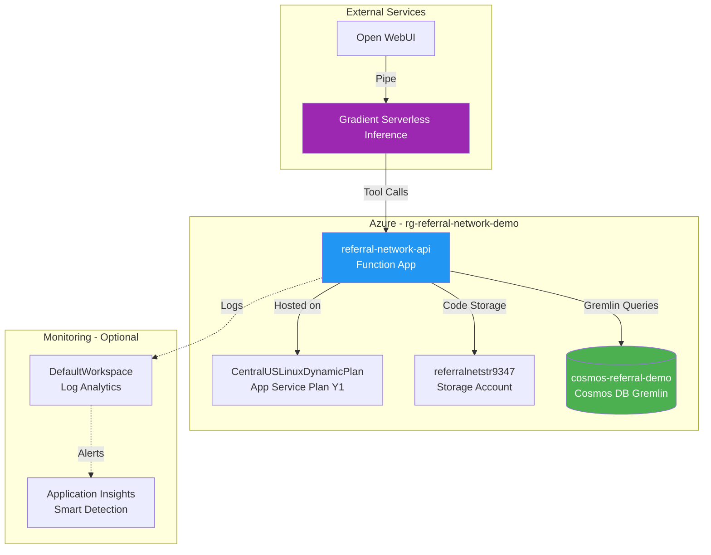

# Azure Service Dependencies

This document describes the Azure services required to run the Referral Network Demo application, how they were provisioned, and their roles in the architecture.

## Architecture Overview

```
┌─────────────────────────────────────────────────────────────────────────────────────┐
│                              EXTERNAL SERVICES                                       │
├─────────────────────────────────────────────────────────────────────────────────────┤
│                                                                                      │
│   ┌─────────────────┐         ┌──────────────────────────────────────┐              │
│   │   Open WebUI    │         │  DigitalOcean Gradient Serverless    │              │
│   │   (Frontend)    │────────▶│  Inference (LLM)                     │              │
│   └─────────────────┘         └──────────────────────────────────────┘              │
│          │                                    │                                      │
│          │ Pipe sends                         │ LLM returns                          │
│          │ tool calls                         │ tool_call requests                   │
│          ▼                                    ▼                                      │
└─────────────────────────────────────────────────────────────────────────────────────┘
                                        │
                                        │ HTTPS
                                        ▼
┌─────────────────────────────────────────────────────────────────────────────────────┐
│                         AZURE RESOURCE GROUP: rg-referral-network-demo              │
├─────────────────────────────────────────────────────────────────────────────────────┤
│                                                                                      │
│   ┌─────────────────────────────────────────────────────────────────────────────┐   │
│   │                     referral-network-api (Function App)                      │   │
│   │                                                                              │   │
│   │  Endpoints:                                                                  │   │
│   │  • /api/health                                                               │   │
│   │  • /api/tools/find_hospital                                                  │   │
│   │  • /api/tools/get_referral_sources                                           │   │
│   │  • /api/tools/get_referral_destinations                                      │   │
│   │  • /api/tools/get_network_statistics                                         │   │
│   │  • /api/tools/find_referral_path                                             │   │
│   │  • /api/tools/get_providers_by_specialty                                     │   │
│   │  • /api/tools/get_hospitals_by_service                                       │   │
│   │  • /api/tools/analyze_rural_access                                           │   │
│   │  • /api/tools/generate_referral_network_diagram                              │   │
│   │  • /api/tools/generate_path_diagram                                          │   │
│   │  • /api/tools/generate_service_network_diagram                               │   │
│   └─────────────────────────────────────────────────────────────────────────────┘   │
│          │                    │                              │                       │
│          │ Hosted on          │ Code stored in               │ Gremlin queries       │
│          ▼                    ▼                              ▼                       │
│   ┌──────────────┐    ┌──────────────────┐    ┌────────────────────────────────┐    │
│   │ CentralUS    │    │ referralnetstr   │    │ cosmos-referral-demo-da495ddc  │    │
│   │ LinuxDynamic │    │ 9347             │    │                                │    │
│   │ Plan         │    │                  │    │ Database: referral-network     │    │
│   │              │    │ (Storage         │    │ Graph: hospital-graph          │    │
│   │ (App Service │    │  Account)        │    │                                │    │
│   │  Plan - Y1)  │    │                  │    │ (Azure Cosmos DB - Gremlin API)│    │
│   └──────────────┘    └──────────────────┘    └────────────────────────────────┘    │
│                                                                                      │
├─────────────────────────────────────────────────────────────────────────────────────┤
│                              MONITORING (Optional)                                   │
├─────────────────────────────────────────────────────────────────────────────────────┤
│                                                                                      │
│   ┌──────────────────────────────┐    ┌──────────────────────────────────────┐      │
│   │ Application Insights Smart   │    │ DefaultWorkspace-d79c8344-...        │      │
│   │ Detection                    │◀───│                                      │      │
│   │                              │    │ (Log Analytics Workspace)            │      │
│   │ (Action Group - Alerts)      │    │                                      │      │
│   └──────────────────────────────┘    └──────────────────────────────────────┘      │
│                                                                                      │
└─────────────────────────────────────────────────────────────────────────────────────┘
```

## Service Dependency Diagram (Mermaid)



## Service Details

### 1. Azure Cosmos DB Account

| Property | Value |
|----------|-------|
| **Name** | `cosmos-referral-demo-da495ddc` |
| **Type** | Azure Cosmos DB account |
| **API** | Gremlin (Graph) |
| **Resource Group** | rg-referral-network-demo |
| **Location** | Central US |
| **Pricing Tier** | Free Tier (1000 RU/s, 25GB free) |
| **Database** | referral-network |
| **Graph/Container** | hospital-graph |

**Purpose:** Stores the hospital referral network as a graph database with vertices (hospitals, providers, services) and edges (referral relationships, employment, service offerings).

**How Provisioned:**
```bash
# Create Cosmos DB account with Gremlin API and Free Tier
az cosmosdb create \
  --name cosmos-referral-demo-da495ddc \
  --resource-group rg-referral-network-demo \
  --capabilities EnableGremlin \
  --enable-free-tier true \
  --default-consistency-level Session \
  --locations regionName="Central US" failoverPriority=0

# Create database
az cosmosdb gremlin database create \
  --account-name cosmos-referral-demo-da495ddc \
  --resource-group rg-referral-network-demo \
  --name referral-network

# Create graph container
az cosmosdb gremlin graph create \
  --account-name cosmos-referral-demo-da495ddc \
  --resource-group rg-referral-network-demo \
  --database-name referral-network \
  --name hospital-graph \
  --partition-key-path /partitionKey
```

**Monthly Cost:** $0 (Free Tier covers 1000 RU/s + 25GB)

---

### 2. Azure Function App

| Property | Value |
|----------|-------|
| **Name** | `referral-network-api` |
| **Type** | Function App |
| **Runtime** | Python 3.11 |
| **Resource Group** | rg-referral-network-demo |
| **Location** | Central US |
| **Hosting Plan** | Consumption (Y1) |

**Purpose:** Hosts the backend API that executes tool calls from the LLM. Each endpoint corresponds to a tool the agent can invoke.

**Endpoints:**

| Endpoint | Method | Description |
|----------|--------|-------------|
| `/api/health` | GET | Health check |
| `/api/tools/find_hospital` | POST | Search hospitals |
| `/api/tools/get_referral_sources` | POST | Find referring hospitals |
| `/api/tools/get_referral_destinations` | POST | Find destination hospitals |
| `/api/tools/get_network_statistics` | POST | Network stats |
| `/api/tools/find_referral_path` | POST | Find paths between hospitals |
| `/api/tools/get_providers_by_specialty` | POST | Find providers |
| `/api/tools/get_hospitals_by_service` | POST | Find hospitals by service |
| `/api/tools/analyze_rural_access` | POST | Rural access analysis |
| `/api/tools/generate_referral_network_diagram` | POST | Generate Mermaid diagram |
| `/api/tools/generate_path_diagram` | POST | Generate path diagram |
| `/api/tools/generate_service_network_diagram` | POST | Generate service diagram |

**How Provisioned:**
```bash
# Create Function App (automatically creates App Service Plan if not exists)
az functionapp create \
  --name referral-network-api \
  --resource-group rg-referral-network-demo \
  --storage-account referralnetstr9347 \
  --consumption-plan-location centralus \
  --runtime python \
  --runtime-version 3.11 \
  --functions-version 4 \
  --os-type Linux

# Configure app settings (environment variables)
az functionapp config appsettings set \
  --name referral-network-api \
  --resource-group rg-referral-network-demo \
  --settings \
    COSMOS_ACCOUNT_NAME=cosmos-referral-demo-da495ddc \
    COSMOS_DATABASE=referral-network \
    COSMOS_GRAPH=hospital-graph \
    COSMOS_PRIMARY_KEY=<your-key>

# Deploy code
cd azure-functions
func azure functionapp publish referral-network-api
```

**Monthly Cost:** $0 (First 1M executions free on Consumption plan)

---

### 3. App Service Plan

| Property | Value |
|----------|-------|
| **Name** | `CentralUSLinuxDynamicPlan` |
| **Type** | App Service plan |
| **SKU** | Y1 (Dynamic/Consumption) |
| **Resource Group** | rg-referral-network-demo |
| **Location** | Central US |
| **OS** | Linux |

**Purpose:** Provides the compute infrastructure for the Function App. The Y1 (Dynamic) SKU means you only pay for execution time, with no base cost.

**How Provisioned:** Automatically created when the Function App was created with `--consumption-plan-location`.

**Monthly Cost:** $0 (Consumption tier has no base cost)

---

### 4. Storage Account

| Property | Value |
|----------|-------|
| **Name** | `referralnetstr9347` |
| **Type** | Storage account |
| **Kind** | StorageV2 |
| **Resource Group** | rg-referral-network-demo |
| **Location** | Central US |
| **Replication** | LRS (Locally Redundant) |

**Purpose:** Required by Azure Functions to store:
- Function code and configuration
- Function execution logs
- Trigger state and checkpoints
- Host ID and lease management

**How Provisioned:**
```bash
az storage account create \
  --name referralnetstr9347 \
  --resource-group rg-referral-network-demo \
  --location centralus \
  --sku Standard_LRS \
  --kind StorageV2
```

**Monthly Cost:** ~$1-2 (minimal storage for function code)

---

### 5. Application Insights Smart Detection (Optional)

| Property | Value |
|----------|-------|
| **Name** | `Application Insights Smart Detection` |
| **Type** | Action group |
| **Resource Group** | rg-referral-network-demo |
| **Location** | Global |

**Purpose:** Provides automated alerting when Application Insights detects anomalies in your application (failures, performance degradation, etc.).

**How Provisioned:** Automatically created when Application Insights was enabled for the Function App.

**Monthly Cost:** $0 (Action groups are free)

**Can Be Deleted:** Yes - this is optional monitoring infrastructure.

---

### 6. Log Analytics Workspace (Optional)

| Property | Value |
|----------|-------|
| **Name** | `DefaultWorkspace-d79c8344-ab62-4fa6-8883-cca9ebd92d7b-CUS` |
| **Type** | Log Analytics workspace |
| **Resource Group** | DefaultResourceGroup-CUS |
| **Location** | Central US |

**Purpose:** Centralized logging destination for Azure resources. Collects logs from Function App executions, Cosmos DB operations, and other Azure services.

**How Provisioned:** Automatically created by Azure when monitoring was enabled.

**Monthly Cost:** ~$0-3 (first 5GB/month free, pay for ingestion beyond that)

**Can Be Deleted:** Yes - this is optional. Deleting it will stop centralized logging but won't affect application functionality.

---

## Cost Summary

| Service | Monthly Cost | Required |
|---------|-------------|----------|
| Cosmos DB (Free Tier) | $0 | Yes |
| Function App (Consumption) | $0 | Yes |
| App Service Plan (Y1) | $0 | Yes |
| Storage Account | ~$1-2 | Yes |
| Application Insights Smart Detection | $0 | No |
| Log Analytics Workspace | ~$0-3 | No |
| **Total** | **~$1-5/month** | |

## Data Flow

1. **User Query** → User asks a question in Open WebUI (e.g., "Show me the referral network")

2. **LLM Processing** → Open WebUI pipe sends the query to Gradient Serverless Inference with tool definitions

3. **Tool Selection** → LLM decides which tool to call (e.g., `generate_referral_network_diagram`)

4. **API Call** → Pipe calls Azure Function endpoint:
   ```
   POST https://referral-network-api.azurewebsites.net/api/tools/generate_referral_network_diagram
   Headers: x-functions-key: <function-key>
   Body: {"include_volumes": true}
   ```

5. **Database Query** → Function App executes Gremlin query against Cosmos DB:
   ```gremlin
   g.E().hasLabel('refers_to').project('from_name','to_name','count')
     .by(outV().values('name'))
     .by(inV().values('name'))
     .by('referral_count')
   ```

6. **Response Generation** → Function transforms data into Mermaid diagram syntax

7. **LLM Summary** → LLM receives tool result, generates natural language response with embedded diagram

8. **Rendering** → Open WebUI renders the Mermaid diagram as an interactive visualization

## Environment Variables

The Function App requires these environment variables (configured as App Settings):

| Variable | Description | Example |
|----------|-------------|---------|
| `COSMOS_ACCOUNT_NAME` | Cosmos DB account name | `cosmos-referral-demo-da495ddc` |
| `COSMOS_PRIMARY_KEY` | Cosmos DB primary key | `abc123...` |
| `COSMOS_DATABASE` | Database name | `referral-network` |
| `COSMOS_GRAPH` | Graph/container name | `hospital-graph` |

## Security Considerations

1. **Function App Authentication**: Protected by function-level keys (`x-functions-key` header)

2. **Cosmos DB Access**: Connection uses primary key stored in Function App settings (not exposed to LLM)

3. **Network**: All traffic is HTTPS encrypted

4. **Secrets Management**: Consider migrating to Azure Key Vault for production deployments

## Troubleshooting

### Function App not responding
```bash
# Check function app status
az functionapp show --name referral-network-api --resource-group rg-referral-network-demo --query state

# View recent logs
az functionapp log tail --name referral-network-api --resource-group rg-referral-network-demo
```

### Cosmos DB connection issues
```bash
# Verify Cosmos DB is accessible
az cosmosdb show --name cosmos-referral-demo-da495ddc --resource-group rg-referral-network-demo --query "{status:provisioningState}"

# Check app settings are configured
az functionapp config appsettings list --name referral-network-api --resource-group rg-referral-network-demo
```

### View Function App logs
```bash
# Stream live logs
func azure functionapp logstream referral-network-api
```
